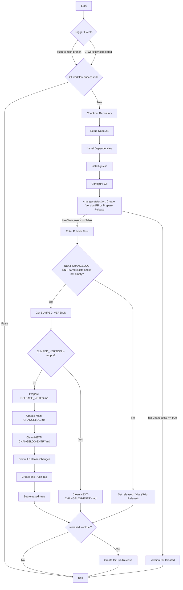

# Release-Scribe

This GitHub Action provides a robust, automated release workflow by seamlessly integrating
[changesets/action](https://github.com/changesets/action) with [git-cliff](https://github.com/orhun/git-cliff).

While changesets is excellent for versioning in monorepos, its default changelog generation is limited. 

This action enhances the process by using git-cliff to generate beautiful, structured changelogs from your Conventional Commits.

Its key feature is a unique two-step changelog process:

1. Preview: When changesets creates a versioning pull request, this action generates a pending changelog and includes it in the PR for team review.

2. Publish: Once the PR is merged, the action automatically updates the root CHANGELOG.md, creates a new Git tag, and publishes a polished GitHub Release.

Key Features:
- 🔄 Automated Versioning: Leverages changesets to manage package versions.
- ✨ Rich Changelogs: Uses git-cliff to generate detailed changelogs from Conventional Commits.
- 👀 Reviewable Release Notes: The "preview" changelog in the PR ensures transparency and quality control before a release goes live.
- 🚀 Zero-Config Goal: Designed to work out-of-the-box for most standard setups.
- 🌳 Monorepo-Ready: Inherits changesets' excellent support for monorepos.

## Bonus: Prisma Support

This workflow includes caching and generation steps for Prisma clients, demonstrating how to integrate database-related tasks into your CI/CD pipeline.

While not entirely generic, if you use Prisma, this might provide some valuable insights.

## The Workflow

