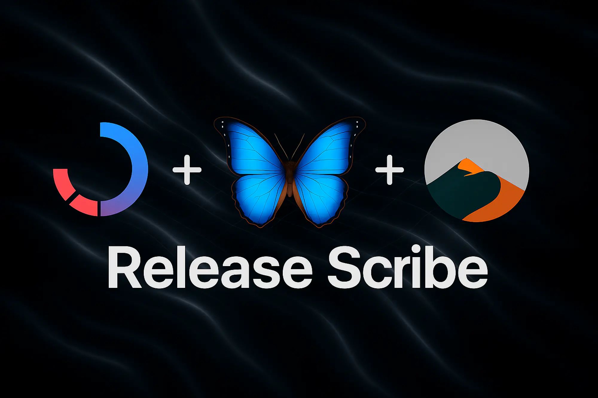
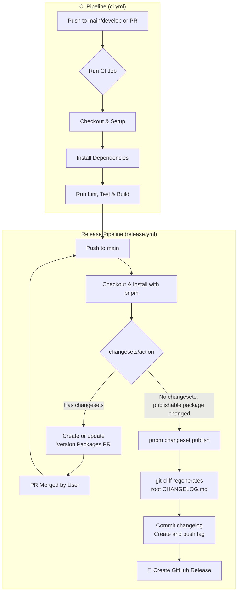

*A powerful, automated release workflow for monorepos, powered by the trifecta of Turborepo, Changesets, and git-cliff.*

This repository is a `pnpm`-first release workflow template for monorepos. It integrates
[changesets/action](https://github.com/changesets/action) with
[git-cliff](https://github.com/orhun/git-cliff) and includes one real publishable demo package:
[`@clinwise/release-scribe`](./packages/release-scribe).

While changesets is excellent for versioning in monorepos, its default changelog generation is limited.

This action enhances the process by using git-cliff to generate beautiful, structured changelogs from your Conventional Commits.

Its key feature is a two-step release process:

1. Preview: When changesets creates a versioning pull request, this repository updates package
   versions, package changelogs, and a pending root release note for review.

2. Publish: Once the PR is merged, the action publishes non-private packages, regenerates the
   root `CHANGELOG.md`, creates a Git tag, and publishes a polished GitHub Release.

Key Features:
- 🚀 **Turborepo-Optimized**: High-speed CI leveraging Turborepo's caching and task orchestration.
- 📦 **pnpm-Native**: Workspace install, caching, and publish commands all use pnpm.
- 🔄 **Automated Versioning**: Leverages changesets to manage package versions across the monorepo.
- ✨ **Rich Changelogs**: Uses git-cliff to generate detailed changelogs from Conventional Commits.
- 👀 **Reviewable Release Notes**: The "preview" changelog in the PR ensures transparency and quality control before a release goes live.
- 🌳 **Monorepo-Ready**: Inherits changesets' excellent support for monorepos.
- 🧪 **End-to-End Publish Proof**: `@clinwise/release-scribe` gives the template one real package to publish.

> **Bonus: Prisma Support**
> 
> This workflow includes caching and generation steps for Prisma clients, demonstrating how to integrate database-related tasks into your CI/CD pipeline.
> 
> While not entirely generic, if you use Prisma, this might provide some valuable insights.

## Customizing the Version PR

When the changesets bot opens a version-package pull request, you may fine-tune the generated changelog to improve clarity and tone. Be aware that any modification to the version package MUST be performed at the very last moment—immediately before merging the PR. At that point the `main` branch has to be frozen: do **not** merge any other pull request that contains changeset files, otherwise the changesets action will issue a force-push which overwrites all your handcrafted commits in the version PR.

## Registry Targets

The template is configured to publish the demo package to GitHub Packages under the `@clinwise`
scope. This matches private package flows such as `@clinwise/fhir-sdk` in `GCPM`.

If you want to adapt the template to npmjs, update:

- `publishConfig.registry` in the publishable package
- `scope` and `registry-url` in `.github/workflows/release.yml`
- the authentication token used by CI

## The Workflow

Here is a high-level overview of the CI and Release process:

```mermaid
graph TD
    subgraph "CI Pipeline (ci.yml)"
        A[Push to main/develop or PR] --> B{Run CI Job};
        B --> C[Checkout & Setup];
        C --> D[Install Dependencies];
        D --> E[Run Lint, Test & Build];
    end

    subgraph "Release Pipeline (release.yml)"
        F[Push to main] --> G[Checkout & Install with pnpm];
        G --> H{changesets/action};
        H -- Has changesets --> I["Create or update<br/>Version Packages PR"];
        I --> J[PR Merged by User];

        H -- No changesets, publishable package changed --> K["pnpm changeset publish"];
        K --> L["git-cliff regenerates<br/>root CHANGELOG.md"];
        L --> M["Commit changelog<br/>Create and push tag"];
        M --> N[🚀 Create GitHub Release];
    end

    E --> F;
    J --> F;
```
