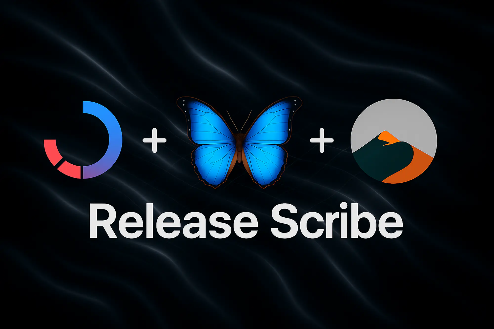
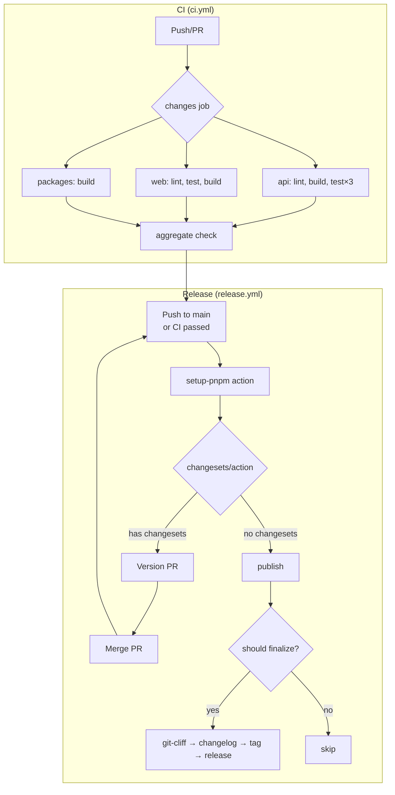

*Changesets + git-cliff monorepo release automation template.*

pnpm monorepo template integrating [changesets/action](https://github.com/changesets/action) with
[git-cliff](https://github.com/orhun/git-cliff) for automated versioning and changelog generation.
Includes a publishable demo package [`@clinwise/release-scribe`](./packages/release-scribe).

## Release Process

Two-step workflow:

1. **Preview** — Changesets opens a version PR updating package versions, package changelogs,
   and a pending root release note (`NEXT-CHANGELOG-ENTRY.md`).
2. **Publish** — After merge, publishes non-private packages, regenerates root `CHANGELOG.md`,
   creates a git tag, and publishes a GitHub Release. Falls back to repository-only finalization
   if the package was already published during a prior validation run.

## CI Architecture

ci.yml implements change detection to avoid running unnecessary jobs:

1. `changes` job diffs against the base branch and maps files to workspace groups (`api`, `web`, `packages`). Push events run all groups unconditionally.
2. Each affected group gets independent lint/build/test jobs. `api-test` runs across 3 shards.
3. A final `ci` job aggregates results into a single required check for branch protection.

All jobs share `.github/actions/setup-pnpm` — a composite action that bakes pnpm setup, Node.js config with caching, Turbo local cache (`actions/cache@v4` for `.turbo/cache`), and dependency install into one step.

## Release Triggers

release.yml supports two events:

- `push` to `main` — immediate release
- `workflow_run` on CI completion — only after CI passes

Concurrency group `release-${{ github.ref }}` prevents duplicate runs when both fire.

## Adapting

**Registry**: demo publishes to GitHub Packages (`@clinwise` scope). To switch to npmjs:
- `publishConfig.registry` in the package
- `scope` + `registry-url` in `.github/workflows/release.yml` (passed to `setup-pnpm` action)
- auth token

**Permissions** the release job needs:
- `contents: write`, `pull-requests: write`, `packages: write`

**Version PR**: manual changelog edits are allowed but must happen last — any other changeset
merge before the version PR lands will cause changesets to force-push and overwrite edits.

```mermaid
graph TD
    subgraph "CI (ci.yml)"
        A[Push/PR] --> B{changes job};
        B --> C1[api: lint, build, test×3];
        B --> C2[web: lint, test, build];
        B --> C3[packages: build];
        C1 & C2 & C3 --> D[aggregate check];
    end

    subgraph "Release (release.yml)"
        E[Push to main<br/>or CI passed] --> F[setup-pnpm action];
        F --> G{changesets/action};
        G -->|has changesets| H[Version PR];
        H --> I[Merge PR];
        G -->|no changesets| J[publish];
        J --> K{should finalize?};
        K -->|yes| L[git-cliff → changelog → tag → release];
        K -->|no| M[skip];
    end

    D --> E;
    I --> E;
```
