*A powerful, automated release workflow for monorepos, powered by the trifecta of Turborepo, Changesets, and git-cliff.*

This GitHub action workflow template provides a robust, automated release workflow by seamlessly integrating
[changesets/action](https://github.com/changesets/action) with [git-cliff](https://github.com/orhun/git-cliff).

While changesets is excellent for versioning in monorepos, its default changelog generation is limited. 

This action enhances the process by using git-cliff to generate beautiful, structured changelogs from your Conventional Commits.

Its key feature is a unique two-step changelog process:

1. Preview: When changesets creates a versioning pull request, this action generates a pending changelog and includes it in the PR for team review.

2. Publish: Once the PR is merged, the action automatically updates the root CHANGELOG.md, creates a new Git tag, and publishes a polished GitHub Release.

Key Features:
- 🚀 **Turborepo-Optimized**: High-speed CI leveraging Turborepo's caching and task orchestration.
- 🔄 **Automated Versioning**: Leverages changesets to manage package versions across the monorepo.
- ✨ **Rich Changelogs**: Uses git-cliff to generate detailed changelogs from Conventional Commits.
- 👀 **Reviewable Release Notes**: The "preview" changelog in the PR ensures transparency and quality control before a release goes live.
- 🌳 **Monorepo-Ready**: Inherits changesets' excellent support for monorepos.

> **Bonus: Prisma Support**
> 
> This workflow includes caching and generation steps for Prisma clients, demonstrating how to integrate database-related tasks into your CI/CD pipeline.
> 
> While not entirely generic, if you use Prisma, this might provide some valuable insights.

## Customizing the Version PR

When the changesets bot opens a version-package pull request, you may fine-tune the generated changelog to improve clarity and tone. Be aware that any modification to the version package MUST be performed at the very last moment—immediately before merging the PR. At that point the `main` branch has to be frozen: do **not** merge any other pull request that contains changeset files, otherwise the changesets action will issue a force-push which overwrites all your handcrafted commits in the version PR.

## The Workflow

Here is a high-level overview of the CI and Release process:

```mermaid
graph TD
    subgraph "CI Pipeline (ci.yml)"
        A[Push to main/develop or PR] --> B{Run CI Job};
        B --> C[Checkout & Setup];
        C --> D[Install Dependencies];
        D --> E[Run Lint, Test & Build];
    end

    subgraph "Release Pipeline (release.yml)"
        F{CI on 'main' branch succeeds} --> G[Trigger Release Workflow];
        G --> H{Checkout & Install};
        H --> I{Has new changesets?};
        I -- Yes --> J["🤖 changesets/action:<br/>- Bumps versions<br/>- Updates changelogs<br/>- Creates 'Version Packages' PR"];
        J --> K[PR Merged by User];

        I -- No --> L["▶️ Publish Flow:<br/>Triggered after 'Version Packages' PR merge"];
        L --> M{NEXT-CHANGELOG-ENTRY.md exists?};
        M -- Yes --> N["CLIFF git-cliff:<br/>- Generates release notes<br/>- Updates main CHANGELOG.md"];
        N --> O["- Commit changelog<br/>- Create & Push Git Tag"];
        O --> P[🚀 Create GitHub Release];
        M -- No --> Q[⏹️ Skip Release];
    end

    E --> F;
    K --> G;
```

